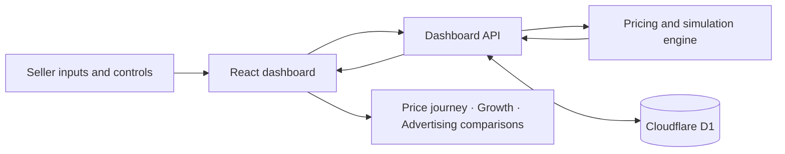

<div align="center">

# Seller Pricing Lab
### A pricing co-pilot for a seller’s first listing—and every decision after it.

**Protect recovery goals · Understand demand · Test prices · Learn from mature outcomes**

[**Explore the live demo →**](https://seller-pricing-lab.seller-pricing-demo.workers.dev) · [Quick start](#quick-start) · [Pricing model](#pricing-model) · [Cloudflare deployment](#deploy-your-own-copy)


</div>

---

## The problem

An experienced offline seller can still struggle with a first online price. Delivery expenses, failed deliveries, returns, advertising and comparable offers change what a sale actually returns to the seller. The lowest competitor price may be unaffordable; a higher price may cover the recovery goal but attract too little demand.

**Seller Pricing Lab makes that trade-off visible.** Sellers choose what they want to recover, review a bounded recommendation, and explore how price, advertising and product outcomes interact over a simulated lifecycle.

Built as a Meesho DICE challenge concept. This is an independent prototype, not an official Meesho product or a live marketplace integration.

> **Evidence boundary:** Orders, competitor trends and campaign outcomes are synthetic. The model demonstrates decision logic; it does not establish actual demand, competitor market share or verified seller profit. The public demo stores shared state—use sample values.

## What you can do

| Capability | Seller experience |
| --- | --- |
| Guided product listing | Enter name, MRP and minimum product recovery amount; adjust visible assumptions and an additional earnings goal. |
| Recovery-based pricing | Inspect the floor, required price, competitor reference and permitted ceiling. |
| Explainable recommendations | See why the recommendation changed, what assumptions matter and when to hold or revisit the price. |
| Lifecycle simulation | Advance up to 16 demo weeks as delivery, returns, quality, stock and market conditions change. |
| Price and growth views | Toggle between the price journey and indexed seller-versus-competitor order growth. |
| Advertising experiments | Compare the baseline, a higher price without ads, and the same price with ads; explore effective and backfiring responses. |
| Seller control | Edit assumptions, apply recommendations, manage automatic demo pricing, and start or stop a bounded ad test. |
| Repeatable demonstrations | Restart one product’s lifecycle while retaining its configured inputs. |
| Five languages | English, Hindi, Marathi, Punjabi and Gujarati, with contextual explanations. |
| Persistent state | Cloudflare D1 stores products, cohorts and history between reloads. |

## Try a three-minute walkthrough

1. **Choose the kurti demo.** Inspect MRP, the recovery amount and the recommended starting price.
2. **Open the explanations.** Review the floor breakdown and how the competitor reference is selected in the concept.
3. **Advance a few weeks.** Watch prices and outcome estimates update as simulated cohorts mature.
4. **Switch to growth.** Compare indexed order trajectories; hover for underlying counts.
5. **Explore advertising.** Compare three alternatives at a fixed test price, then switch between effective and backfiring traffic.
6. **Change scenario.** Inspect jewellery under competitive pressure or a home product with quality problems.
7. **Restart lifecycle.** Return the selected product to week zero for another demonstration.

### Three seeded scenarios

| Product | Scenario | What it illustrates |
| --- | --- | --- |
| Printed cotton kurti | Growth, then softer demand | Demand changes over time; a launch recommendation is a starting hypothesis. |
| Brass stud combo | Competitive pressure | A competitor’s lower price does not automatically justify selling below the recovery requirement. |
| Cotton cushion cover | Quality problems | Weak outcomes may require fixing quality or the listing rather than discounting. |

## Pricing model

### Start with the seller’s recovery requirement

**V** is the minimum amount the seller wants to recover for the product itself, before packaging, delivery, returns, advertising and GST. It may already include desired earnings. It is stored as `inputs.cost` for compatibility with the original implementation; that field name does **not** make it verified procurement cost.

**M** is an optional *additional* earnings goal per kept order, before GST. Enter zero if the desired earnings are already fully included in V.

A **kept order** is dispatched, delivered and not returned. With RTO rate `r` per dispatch and customer-return rate `g` per delivery:

```text
K = (1 − r) × (1 − g)

TC = Cpk + Cf + A + Cpf × (1 − r) + Cr × (1 − r) × g
     + V × [K + r × drto + (1 − r) × g × dret]

F = (TC / K) × (1 + GST)                 when K > 0
R = F + M × (1 + GST)
L = ceil(max(R, seller minimum price))
H = floor(min(MRP, seller price cap))
Q = floor(min(comparable price − ₹1, min(MRP, seller price cap)))
```

| Symbol | Meaning |
| --- | --- |
| `Cpk`, `Cf` | Packaging and forward freight per dispatch |
| `A` | Advertising expense per dispatch; zero when disabled |
| `Cpf` | Non-refundable fee per delivered order, if applicable |
| `Cr` | Handling/reverse freight per customer return |
| `drto`, `dret` | Assumed unrecovered fractions of V for RTOs and customer returns |
| `TC` | Expected recovery requirement and online expenses per dispatch |
| `F` | GST-inclusive recovery floor |
| `R`, `L` | Required price and whole-rupee minimum acceptable price |
| `H`, `Q` | Maximum permitted price and competitive candidate |

The implementation applies a small floating-point tolerance before rounding L.

### Choose a feasible candidate, then learn

| Condition | Decision |
| --- | --- |
| `K = 0` | Block a recommendation; revisit delivery and return assumptions. |
| `L > H` | No feasible whole-rupee price; revisit the goal, costs or offer. |
| `Q ≥ L` | The competitive candidate is eligible for a test. |
| `Q < L ≤ H` | Test the required price above the competitor reference. |

During the lifecycle, the engine also respects price-step limits, immature evidence, quality flags and campaign holds. A valid current price can be held even when the competitor reference moves.

The ₹1 undercut is a test heuristic, not a guarantee of ranking, clicks or orders. MRP is a ceiling, not an estimate of product cost. Recovery-based surplus should not be presented as verified accounting profit.

### How the simulation learns

- RTO outcomes become eligible after one demo week; return outcomes mature after two.
- Initial RTO and return assumptions blend with resolved outcomes using fixed prior weights.
- Scenario rules vary traffic, conversion, competition, quality and fulfilment costs.
- Lifecycle labels combine evidence gates with demo-week rules; they are not a trained classifier.
- Advertising tests run for up to three demo weeks and can stop earlier when model guardrails trigger.
- Growth is indexed to the first common positive baseline, set to 100. Competitor orders are generated assumptions, not observed marketplace data.

**The growth comparison is currently explanatory; it does not feed back into the pricing recommendation.**

## Architecture



| Layer | Implementation |
| --- | --- |
| Interface | React 19, TypeScript, Radix UI, Recharts, Tailwind/CSS |
| App runtime | Vinext on Vite, using the Next.js App Router model |
| Pricing engine | Pure calculation and scenario functions in `lib/pricing.ts` |
| Growth comparison | Indexed series in `lib/growth.ts` |
| Persistence | D1 single shared demo-state record with optimistic version checks |
| Hosting | Cloudflare Workers with static assets |

### Repository map

```text
app/
  dashboard.tsx          Main seller interface
  campaign-lab.tsx       Advertising comparison and controls
  growth-chart.tsx       Seller-versus-competitor growth view
  api/dashboard/route.ts Read and mutate demo state
lib/
  pricing.ts             Pricing, cohorts, lifecycle and campaigns
  growth.ts              Synthetic competitor orders and indexing
  storage.ts             D1 persistence and version checks
  i18n.tsx               Translation provider
  translations.json      Regional-language strings
drizzle/                 Database schema migration
tests/                   Growth and localization checks
vite.config.ts           Application build configuration
wrangler.cloudflare.json Standalone Cloudflare deployment template
```

## Quick start

**Requirements:** Node.js 22.13 or later, npm, and Git. A Cloudflare account is only required for deployment; local D1 runs through Wrangler.

```bash
git clone https://github.com/khush1811/seller-pricing-lab.git
cd seller-pricing-lab
npm run install:ci

# Initialise local storage in the same location used by the production preview.
npx wrangler d1 execute seller-pricing-demo --local \
  --config wrangler.cloudflare.json --persist-to .wrangler/state \
  --file drizzle/0000_third_bulldozer.sql

npm run build
npm run start
```

Open the address printed by Wrangler. The three sample products are created on the first successful database read. Run the schema command once per fresh local database. On PowerShell, put the multiline command on one line or use PowerShell continuation syntax.

`npm run dev` provides the Vite development loop on port 5173. Its local Worker storage may use a different persistence location from the production preview above; initialise the database for that environment before using the dashboard.

### Checks

```bash
npx tsc --noEmit
node tests/growth.mjs
node tests/localization.mjs
npm run build
```

The growth checks cover all three scenarios, common baselines, recorded seller orders, zero-order handling and resets. Localization checks verify translation coverage. These are focused regression checks, not a full end-to-end or pricing-validation suite.

## Deploy your own copy

The included Cloudflare configuration contains a placeholder database ID. Replace it with your own database ID; do not reuse the live demo’s resources.

```bash
npx wrangler login
npx wrangler d1 create seller-pricing-demo
```

Copy the returned `database_id` into `wrangler.cloudflare.json`, keeping the binding named `DB`. Choose a unique Worker `name` if needed.

```bash
# Once for a fresh remote database:
npx wrangler d1 execute seller-pricing-demo --remote \
  --config wrangler.cloudflare.json \
  --file drizzle/0000_third_bulldozer.sql

npm run build
npx wrangler deploy --config wrangler.cloudflare.json
```

On a new account, Wrangler may ask you to register a `workers.dev` subdomain. Use the URL returned by deployment. Future updates need only a build and deploy unless the database schema changes.

The `.openai/hosting.json` file retains the starter’s build metadata with a generic `DB` binding. The Cloudflare deployment uses `wrangler.cloudflare.json` and does not require ChatGPT authentication. Local credentials, build output and database files are excluded from Git.

## Scope and next steps

| Working in this prototype | Requires further implementation or validation |
| --- | --- |
| Deterministic synthetic scenarios | Live marketplace and settlement integrations |
| Recovery-based recommendation rules | Validated category-specific demand and return estimates |
| Seller-approved or automatic demo changes | Real listing changes with production approval controls |
| Shared persistent demo workspace | Seller accounts, tenant isolation and production access controls |
| Price and growth charts | Verified competitor growth data and growth-aware optimisation |
| Localized interface | Field-tested comprehension and translation review |
| Scenario comparisons | Controlled experiments establishing causal seller benefit |

The public prototype is intentionally small: it supports up to 20 products, a 16-week simulation and shared state. Anyone with access can change that shared state. Do not enter confidential seller data. Several legacy labels and internal names still use “cost” or “profit”; interpret outputs according to the recovery-based model above.

## Contributing

Keep changes focused and explain their impact on seller decisions. For pricing changes, document units, probability denominators, rounding and recovery-versus-profit semantics; include a reproducible example. Run the checks above before proposing changes. Never commit tokens, local database state or private seller records.

## Credits and usage

Concept developed for the Meesho DICE challenge by the project team. Meesho/DICE names and branding belong to their respective owners; their use does not imply endorsement. The repository retains third-party notices, including the vendored build adapter’s license. No additional open-source license is granted for the project’s original code in this snapshot.

